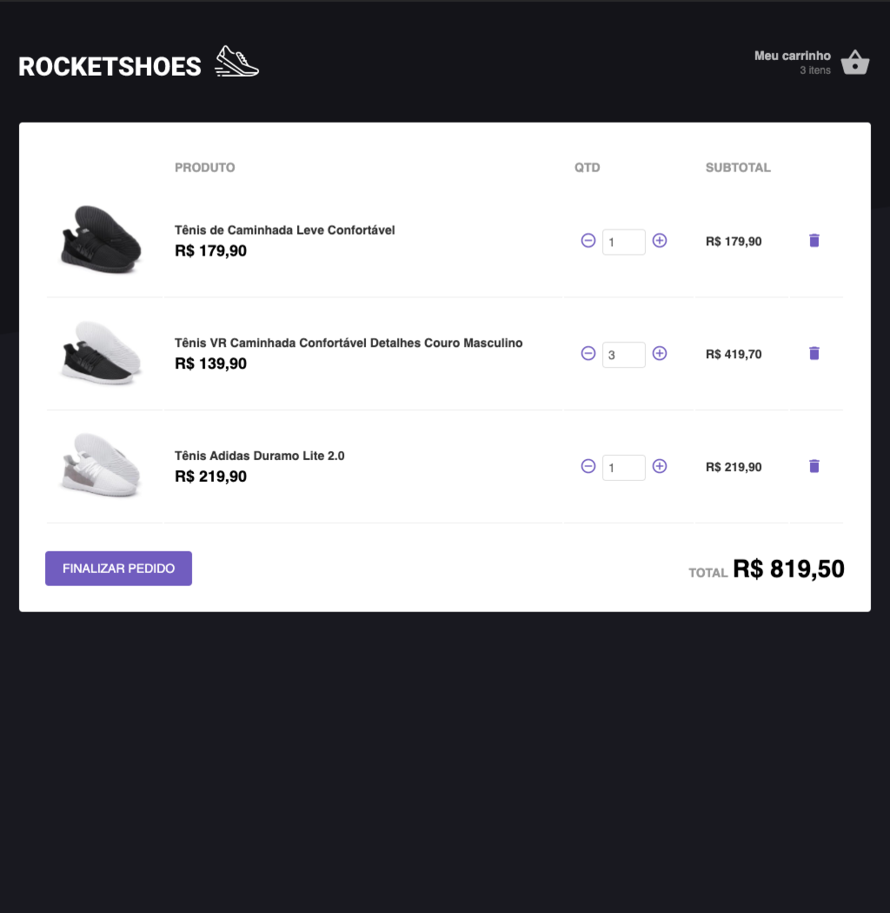

<h1 align="center">
  
</h1>

<h3 align="center">Rocketshoes</h3>

Projeto do desafio do 7º módulo do Bootcamp GoStack.

  
  

## 💻 O que é?

RocketShoes é um aplicativo em React para simular uma aplicação de compras online. É possível adicionar comprar ao carrinho e alterar o carrinho.

## 🚀 Instalação e execução

1. Abra a pasta do projeto e execute `yarn` para instalar as dependências;
3. Execute ` json-server server.json -p 3333` para rodar o servidor no [json-server](https://github.com/typicode/json-server]).
2. Rode `yarn start` para iniciar a aplicação.
